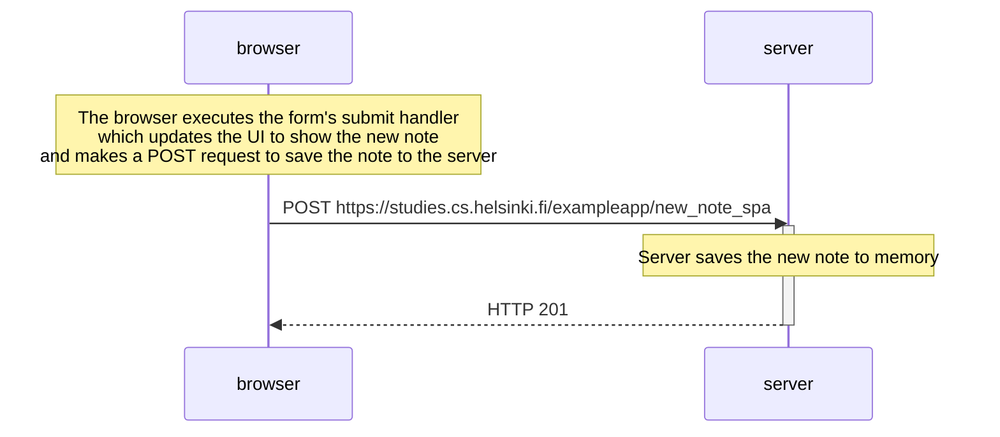

```mermaid
sequenceDiagram
    participant browser
    participant server

    Note over browser: The browser executes the form's submit handler<br>which updates the UI to show the new note<br>and makes a POST request to save the note to the server
    browser->>server: POST https://studies.cs.helsinki.fi/exampleapp/new_note_spa
    activate server
    Note over server: Server saves the new note to memory
    server-->>browser: HTTP 201
    deactivate server
```
